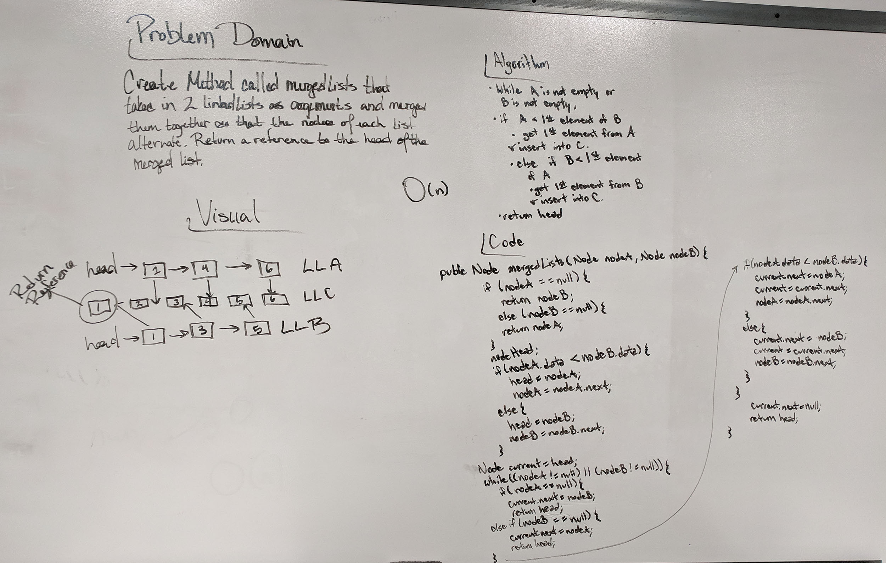

# Code Challenge 08: Merging Linked Lists

Paired with Trey Herndon. 
Reference: <a href="https://stackoverflow.com/questions/10707352/interview-merging-two-sorted-singly-linked-list">Stack Overflow: Merging Sorted Singly Linked List</a>

## Feature Task:

Create a method called mergedLists that takes in two linked lists as arguments and merges them together so that the nodes of each list alternate. Return a reference to the head of the merged list. 

## Approach and Efficiency:

Takes two linked lists, A & B. While A is not empty or B is not empty: if A is less than the first element of B, get the first element from A. Else if B is less than the first element of A, get the first element from B. Return the head. O(n). 

## Solution:
  