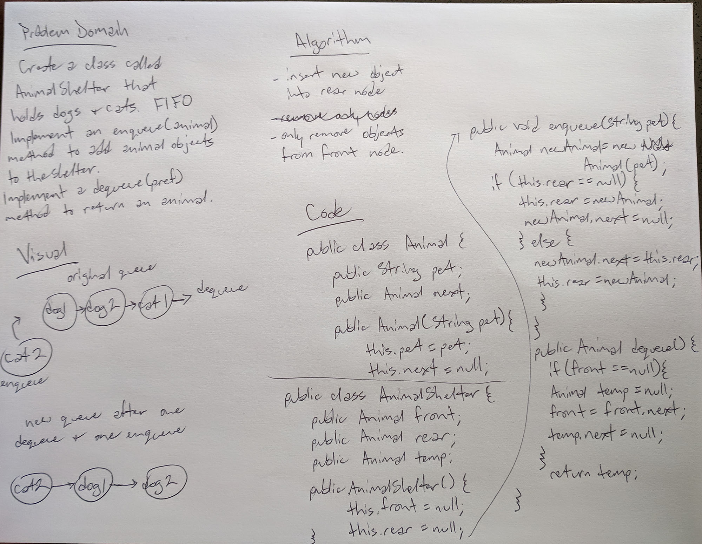

# Code Challenge 12:

First-in, First-out Animal Shelter

## Feature Task:

Create a class called AnimalShelter that holds dogs and cats. Using FIFO, implement and enqueue(animal) method to add animal objects to the shelter. Implement a dequeue(pref) method to return an animal. 

## Approach and Efficiency:

Enqueue to insert new object into rear node. Dequeue to remove object from front node. 

## Solution:

