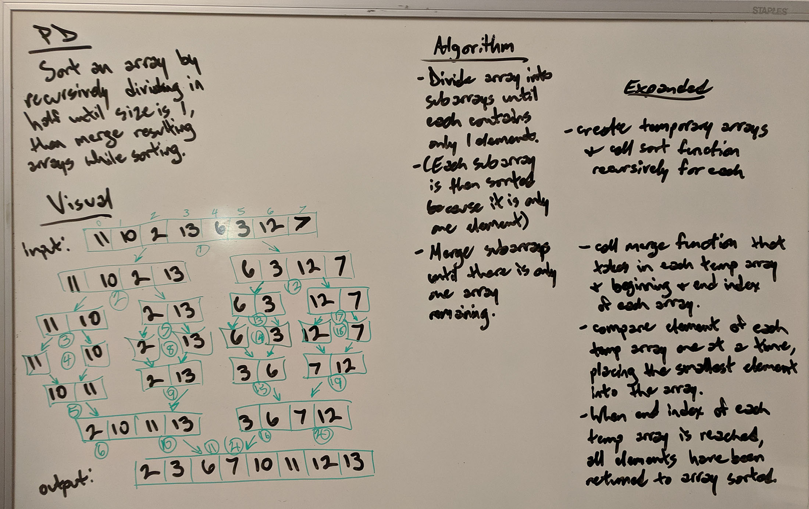

# Lecture Notes: Merge Sort

## Learning Objectives

Sort an array by recursively dividing it in half until the size is 1, then merge resulting arrays while sorting. 

## Lecture Flow

1. Start with problem domain.
2. Draw visual examples and walk through recursion. 
3. Write out algorithm.
4. Write out code. 
5. Step through with examples.

## Diagram

## Algorithm

1. Divide array into subarrays (temporary arrays) recursively until each contains only one element. Each temp array is then sorted because it only has one element. 
2. Call merge function that takes in each temp array, the beginning, and end index of each array. 
3. Compare elements of each temp array one at a time, placing smallest elements back into array. 
4. When the ending index of each temp array is reached, all elements have been returned to the array sorted.  

## Pseudocode

MergeSort(arr[], left, right)
 
if right > left
 
middle = (left+right)/2
 
mergeSort(arr, left, middle)
 
mergeSort(arr, middle + 1, right)
 
merge(arr, left, middle, right)

## Readings and References

Watch: <a href="https://www.youtube.com/watch?v=iMT7gTPpaqw">Joe James Java: MergeSort explained</a>

Read: <a href="https://en.m.wikipedia.org/wiki/Merge_sort"> Merge Sort: Wikipedia</a>
 
<a href="https://www.geeksforgeeks.org/merge-sort/">Merge Sort: Geeks for Geeks</a>

Bookmark: <a href="https://canvas.instructure.com/courses/1576285/assignments/11066195">Code Challenge 27</a>